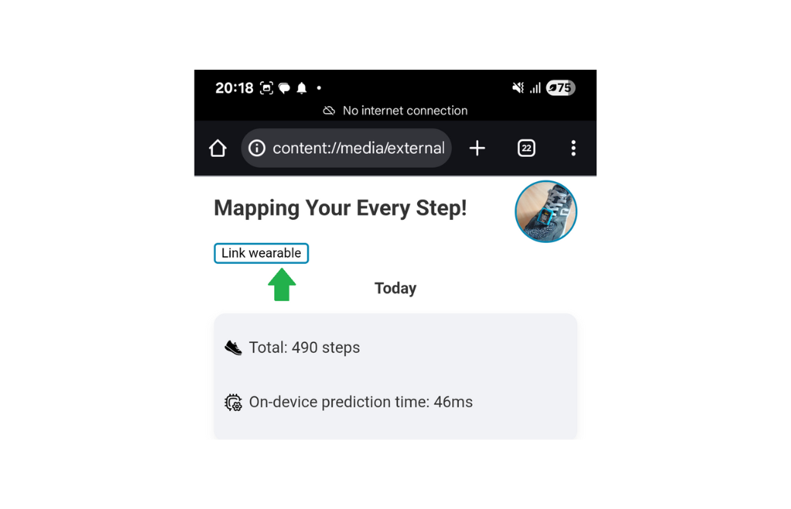
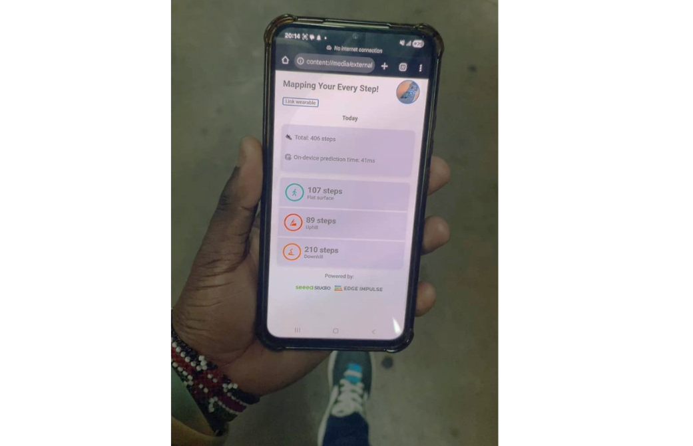

# Adding terrain classification to step counting wearables


This demo research project tackles a significant shortcoming of step counting wearables/applications in that they do not integrate terrain analysis which is significant to calorie burning and cardiovascular benefits. For example, walking uphill requires more effort from the heart, muscles and lungs, and more calories are also burned.

To implement terrain classification while walking, the project leverages embedded AI technology which allows us to run light-weight AI models on microcontrollers connected to sensors. I used the XIAO nRF52840 Sense given that it has an onboard 6 DOF IMU (LSM6DS3TR-C), Bluetooth LE 5.2, ultra-Low power consumption, and it's small form factor makes it a great fit for a wearable. The onboard IMU is used to capture angle of a surface from a foot level while the BLE connectivity is used to send terrain classification results to a simple offline BLE WebApp that we can access on our mobile devices (there is a [desktop version](BLE-WebApp/index.html) as well, but mobile webapp is the most convenient).


By using the accelerometer data from the IMU, we can observe that there is a data "trend" between the different slopes from a time series representation of motion data. This tells us that an AI model is capable of analyzing these trends and learning the terrain slopes, adding to step detection/calculation which they are exceptionally good at.   


I used the Edge Impulse platform to collect data, train a motion classification model and finally deploy it to the XIAO nRF52840 Sense board. You can find the public project here: [Walk terrain classification](https://studio.edgeimpulse.com/public/775241/latest).

3D print files for the wearable are available in the [CAD-designs](CAD-designs/) folder and [Printables.com](https://www.printables.com/model/1418110-xiao-nrf52840-sense-case).

## Quick Start

- On your PC, ensure that you have installed Arduino IDE and the Seeed nRF52 mbed-enabled Boards by Seeed Studio.
- Install the [LSM6DS3 library](Libraries/Seeed_Arduino_LSM6DS3-master.zip) in Arduino IDE.
- Install Edge Impulse CLI. You can follow [Seeed Studio's tutorial](https://wiki.seeedstudio.com/XIAOEI/#connecting-to-edge-impulse).
- Connect your XIAO nRF52840 Sense to your PC using the USB-C slot and upload the [Arduino Sketch](Arduino-sketches/XIAO_nRF52840_EI_LSM6DS3_data/XIAO_nRF52840_EI_LSM6DS3_data.ino) to send raw IMU data via Serial.


- Use a CLI to connect the XIAO nRF52840 Sense with Edge Impulse Studio. Afterwards, collect data while walking on different terrains for their respective class (labels).

- Still on Edge Impulse Studio, deploy your Impulse (Machine Learning pipeline with sampling, processing and classification) as an Arduino library.

- Install the downloaded library to Arduino IDE. At this point, also install the [Arduino BLE library](Libraries/ArduinoBLE-master.zip).

- Finally, upload the [inference sketch](Arduino-sketches/XIAO_nRF52840_BLE_terrain_classification/XIAO_nRF52840_BLE_terrain_classification.ino) to the XIAO nRF52840 Sense.

- Copy the HTML [mobile WebApp file](BLE-WebApp/index_mobile.html) to a smartphone and open it with a browser that supports Web Bluetooth API such as Google Chrome.

- On the simple UI, click the 'Link wearable' button and select 'XIAO-nRF52840-Sense'. 




Start walking and you will see terrain classification results from the board. The frequency at which the XIAO board transmits data via BLE is configured by the ```ble_upload_ms``` variable in the [inference sketch](Arduino-sketches/XIAO_nRF52840_BLE_terrain_classification/XIAO_nRF52840_BLE_terrain_classification.ino). Note that increasing the transmission rate will increase the energy consumption rate from the battery.



## Development environment

- Arduino IDE version 2.3.6
- Arduino's Seeed nRF52 mbed-enabled Boards by Seeed Studio version 2.7.2
- Arduino's LSM6DS3 library by Seeed Studio version 2.7.2